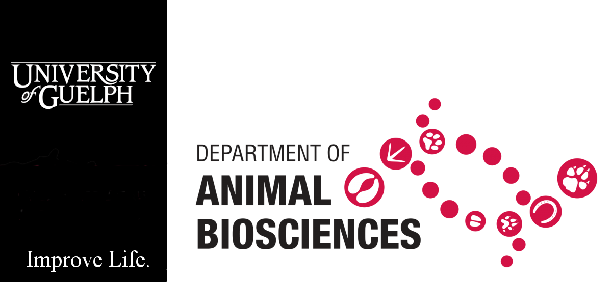

# NASEM 2021 Dairy Model - Shiny App


This is the source code for a shiny app (using Shiny for Python) that
imports the `nasem_dairy` package from
https://github.com/CNM-University-of-Guelph/NASEM-Model-Python

This is the documentation website for the **NASEM Shiny** web
application.

This app is a simplified version of the model described in the 8th
Edition of the <a
href="https://www.nationalacademies.org/our-work/nutrient-requirements-of-dairy-cattle-8th-edition"
target="_blank">Nutrient Requirements of Dairy Cattle book</a>.

The current version of this app supports Lactating and Dry Cows and is
being developed for teaching and research only. This software should not
be used for on-farm or commercial decisions.

## Free online access

The current version of NASEM Shiny is hosted at:
<https://dave-innes-uog.shinyapps.io/nasem_shiny/>

> ## Acknowledgements:
>
> The Shiny App and associated python implementation of the NASEM model
> was developed by Dave Innes, Braeden Fieguth and John Cant, University
> of Guelph. The model was based on the original R code that is included
> with the book [and
> online](https://nap.nationalacademies.org/resource/25806/Installation_Instructions_NASEM_Dairy8.pdf).
>
> The source code for the latest Python implementation of the model can
> be viewed [on
> GitHub](https://github.com/CNM-University-of-Guelph/NASEM-Model-Python).
>
> 

## Running locally

The shiny app can also be executed on a user’s computer. However, some
knowledge of Python and VSCode is required.
<details>
<summary>
<strong>How to Setup and Run the Shiny App Locally</strong>
</summary>

### Step 1: Install Git

1.  Open a terminal or command prompt.

2.  For macOS, install Git using Homebrew:

    ``` bash
    brew install git
    ```

    For Ubuntu/Debian-based Linux distributions, install Git using apt:

    ``` bash
    sudo apt-get update
    sudo apt-get install git
    ```

    For Windows, download and install the Git executable from
    [git-scm.com](https://git-scm.com).

### Step 2: Clone the Repository

1.  Open your terminal or command prompt.

2.  Navigate to the directory where you want to clone the repository.

3.  Run the following command

    ``` bash
    git clone https://github.com/CNM-University-of-Guelph/NASEM-shiny.git
    ```

### Step 3: Set Up the Conda Environment

1.  Navigate into the cloned repository directory:

    ``` bash
    cd NASEM-shiny
    ```

2.  Create a new conda environment and install the required packages:

    ``` bash
    conda env create --file environment.yml --name NASEM_env 
    ```

    > [!IMPORTANT]
    >
    > There is an additional file called `requirements.txt` that is used
    > for deploying to \<shinyapps.io\>.

3.  Activate the newly created environment:

    ``` bash
    conda activate NASEM_env
    ```

### Step 4: Install VSCode Shiny Extension

1.  Open Visual Studio Code (<a href="https://code.visualstudio.com/"
    target="_blank">https://code.visualstudio.com/</a>)
2.  Go to the Extensions view by clicking on the square icon on the
    sidebar or pressing `Ctrl+Shift+X`.
3.  Search for “Shiny”.
4.  Click on the install button next to the extension.

### Step 5: Run the Shiny App Locally

1.  In VSCode, open the folder containing the cloned Shiny for Python
    application.
2.  Open `app.py`
3.  Open a new terminal and ensure your conda environment is activated.
4.  Press the play  button at the top right corner of
    app.py to run the shiny app

</details>
